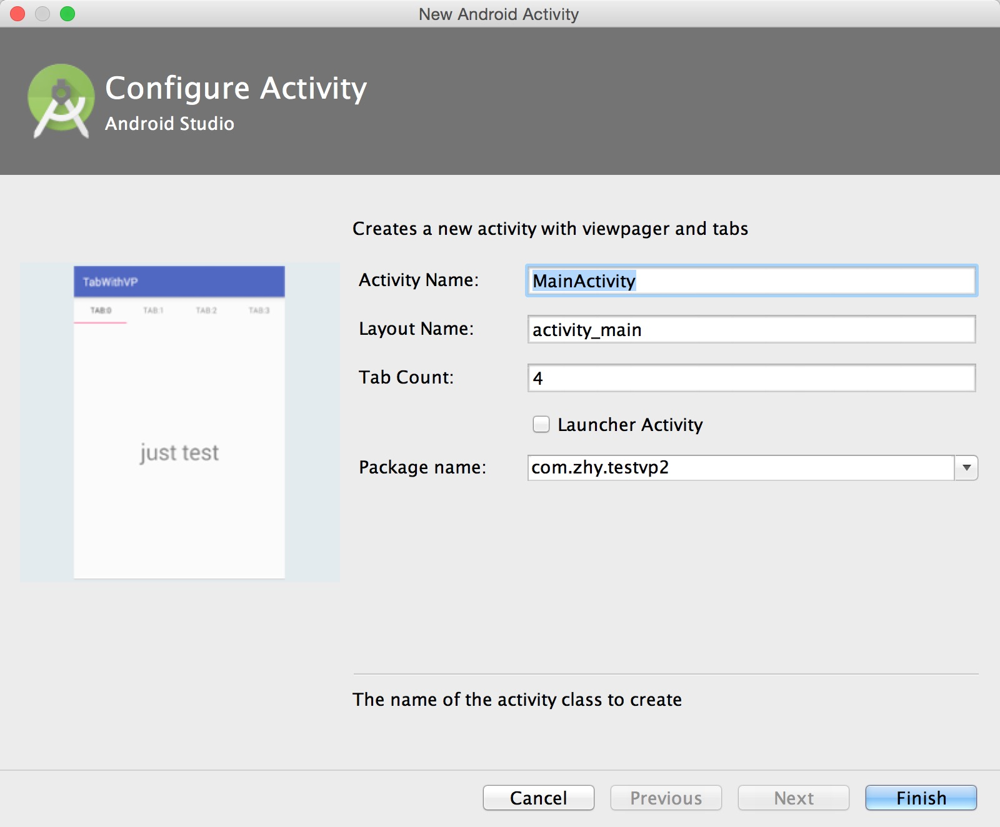
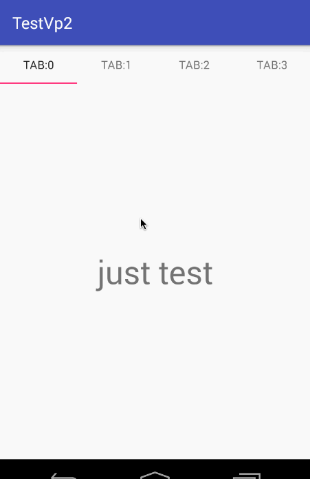

# AndroidStudioTemplates
Templates for Android Studio

这是一个协作写项目，申请加入该[WanAndroid](https://github.com/WanAndroid)组织，然后将你编写的模板文件开源与大家分享。


## 如何编写

如果你想参与，但是还不会编写模板，可以参考下面几篇教程：

* http://blog.csdn.net/lmj623565791/article/details/51635533
* http://www.i-programmer.info/professional-programmer/resources-and-tools/6845-android-adt-template-format-document.html
* https://developer.android.com/studio/projects/templates.html
* http://robusttechhouse.com/tutorial-how-to-create-custom-android-code-templates/


## 模板的用法

copy至Android Studio对应的文件目录，重启Android Studio即可。

相应的目录：

```
{Android Studio}/plugins/android/lib/templates/activities

{Android Studio}/plugins/android/lib/templates/custom

{Android Studio}/plugins/android/lib/templates/other
```

## 文件结构

将你的模板文件提交，例如是XXXActivity，可以放至：

`/activities/XXXActivity`

其他类型的有custom,other文件夹，与AS一致即可。

## 目前包含模板

* ViewPagerWithTabActivity 

使用



效果
 



